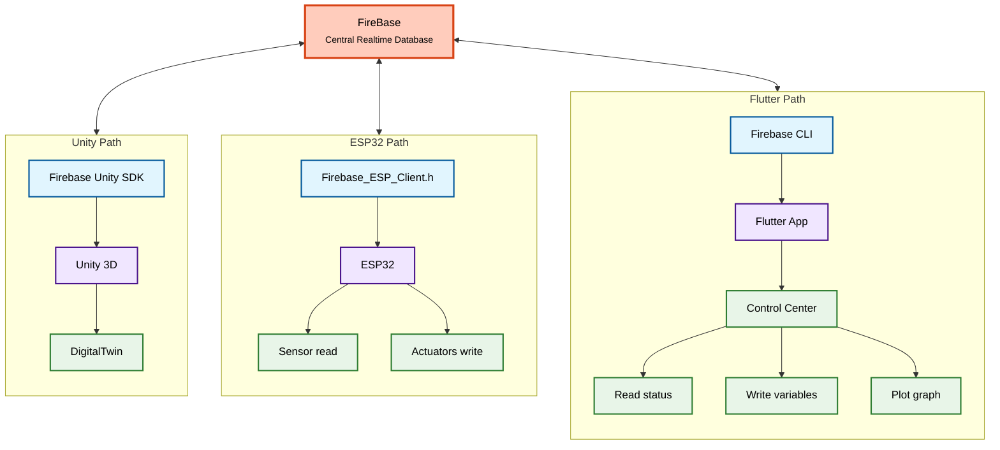

# Data Flow 

```mermaid

flowchart TD
    Firebase["FireBase<br/><span style='font-size:smaller'>Central Realtime Database</span>"]

    subgraph Unity_Path ["Unity Path"]
        direction TB
        UnitySDK["Firebase Unity SDK"]
        Unity3D["Unity 3D"]
        DigitalTwin["DigitalTwin"]
        UnitySDK --> Unity3D --> DigitalTwin
    end

    subgraph ESP32_Path ["ESP32 Path"]
        direction TB
        ESPClient["Firebase_ESP_Client.h"]
        ESP32["ESP32"]
        SensorRead["Sensor read"]
        ActuatorsWrite["Actuators write"]
        ESPClient --> ESP32
        ESP32 --> SensorRead
        ESP32 --> ActuatorsWrite
    end

    subgraph Flutter_Path ["Flutter Path"]
        direction TB
        FirebaseCLI["Firebase CLI"]
        FlutterApp["Flutter App"]
        ControlCenter["Control Center"]
        ReadStatus["Read status"]
        WriteVars["Write variables"]
        PlotGraph["Plot graph"]
        FirebaseCLI --> FlutterApp --> ControlCenter
        ControlCenter --> ReadStatus
        ControlCenter --> WriteVars
        ControlCenter --> PlotGraph
    end

    %% Bidirectional connections
    Firebase <--> Unity_Path
    Firebase <--> ESP32_Path
    Firebase <--> Flutter_Path

    %% Styling
    classDef central fill:#ffccbc,stroke:#d84315,stroke-width:3px,color:#000;
    classDef client fill:#e1f5fe,stroke:#01579b,stroke-width:2px,color:#000;
    classDef device fill:#f0e6ff,stroke:#4a148c,stroke-width:2px,color:#000;
    classDef action fill:#e8f5e8,stroke:#2e7d32,stroke-width:2px,color:#000;

    class Firebase central
    class UnitySDK,ESPClient,FirebaseCLI client
    class Unity3D,ESP32,FlutterApp device
    class DigitalTwin,SensorRead,ActuatorsWrite,ReadStatus,WriteVars,PlotGraph,ControlCenter action
```

## Structure Diagram (Class Diagram – Recommended for JSON Object Model)

```mermaid
classDiagram
    class Pod_01_Claw_01 {
        raw_value : integer
        rtc : float
        settings : object
        temperature : float
        timestamp : integer
    }
    class Pod_01_Claw_01_connection_package {
        noise_amount : float
        send_interval : integer
        sensor_buffer_time : integer
        sin_amplitude : integer
        sin_period_minutes : integer
        temp_coefficient : integer
    }
    Pod_01_Claw_01 --> "connection_package" Pod_01_Claw_01_connection_package

    class Pod_01_base_01 {
        avg_light : integer
        brightness : integer
        locker : object
        sensor_weights : object
        sensors : object
        settings : object
        timestamp : integer
    }
    class Pod_01_base_01_locker {
        door : integer
        spot : integer
    }
    Pod_01_base_01 --> "locker" Pod_01_base_01_locker
    class Pod_01_base_01_sensor_weights {
        sensor0 : integer
        sensor1 : integer
        sensor2 : integer
        sensor3 : integer
    }
    Pod_01_base_01 --> "sensor_weights" Pod_01_base_01_sensor_weights
    class Pod_01_base_01_sensors {
        sensor_weights : object
        sensors_data : object
    }
    Pod_01_base_01 --> "sensors" Pod_01_base_01_sensors
    class Pod_01_base_01_connection_package {
        qty_reading_sensors_in_second : integer
        send_interval : integer
        sensor_buffer_time : integer
    }
    Pod_01_base_01 --> "connection_package" Pod_01_base_01_connection_package
    class Pod_01_base_01_light_mapping {
        light_threshold : integer
        min_light : integer
        target_light : integer
    }
    Pod_01_base_01 --> "light_mapping" Pod_01_base_01_light_mapping
    class Pod_01_base_01_light_mode {
        manual_override : integer
        manual_toggle : integer
    }
    Pod_01_base_01 --> "light_mode" Pod_01_base_01_light_mode

    class Pod_01_entrada_01 {
        door_state : integer
        settings : object
        spot_state : integer
        timestamp : integer
    }
    class Pod_01_entrada_01_connection_package {
        send_interval : integer
    }
    Pod_01_entrada_01 --> "connection_package" Pod_01_entrada_01_connection_package

    class ConnectionPackage {
        send_interval : integer
        noise_amount? : float
        sensor_buffer_time? : integer
        sin_amplitude? : integer
        sin_period_minutes? : integer
        temp_coefficient? : integer
        qty_reading_sensors_in_second? : integer
    }
    Pod_01_Claw_01 --> "connection_package" ConnectionPackage
    Pod_01_base_01 --> "connection_package" ConnectionPackage
    Pod_01_entrada_01 --> "connection_package" ConnectionPackage


```

## Data Flow / Hierarchy Diagram (Flowchart – Top-Down View with Values)

```mermaid

flowchart TD
    Root["devices (root object)"]
    Pod_01_Claw_01["Pod_01_Claw_01<br/>timestamp: 27067"]
    Root --> Pod_01_Claw_01
    Pod_01_Claw_01 --> Pod_01_Claw_01_raw_value["raw_value: 2216"]
    Pod_01_Claw_01 --> Pod_01_Claw_01_rtc["rtc: 22.13876"]
    Pod_01_Claw_01 --> Pod_01_Claw_01_settings["settings (object)"]
    Pod_01_Claw_01 --> Pod_01_Claw_01_temperature["temperature: 22.13876"]

    Pod_01_base_01["Pod_01_base_01<br/>timestamp: 231"]
    Root --> Pod_01_base_01
    Pod_01_base_01 --> Pod_01_base_01_avg_light["avg_light: 1830"]
    Pod_01_base_01 --> Pod_01_base_01_brightness["brightness: 0"]
    Pod_01_base_01 --> Pod_01_base_01_locker["locker (object)"]
    Pod_01_base_01 --> Pod_01_base_01_sensor_weights["sensor_weights (object)"]
    Pod_01_base_01 --> Pod_01_base_01_sensors["sensors (object)"]
    Pod_01_base_01 --> Pod_01_base_01_settings["settings (object)"]
    Pod_01_base_01_sensors --> Pod_01_base_01_sensors_sensor_weights["sensor_weights (object)"]
    Pod_01_base_01_sensors --> Pod_01_base_01_sensors_sensors_data["sensors_data (object)"]

    Pod_01_entrada_01["Pod_01_entrada_01<br/>timestamp: 2353"]
    Root --> Pod_01_entrada_01
    Pod_01_entrada_01 --> Pod_01_entrada_01_door_state["door_state: 0"]
    Pod_01_entrada_01 --> Pod_01_entrada_01_settings["settings (object)"]
    Pod_01_entrada_01 --> Pod_01_entrada_01_spot_state["spot_state: 0"]
```

