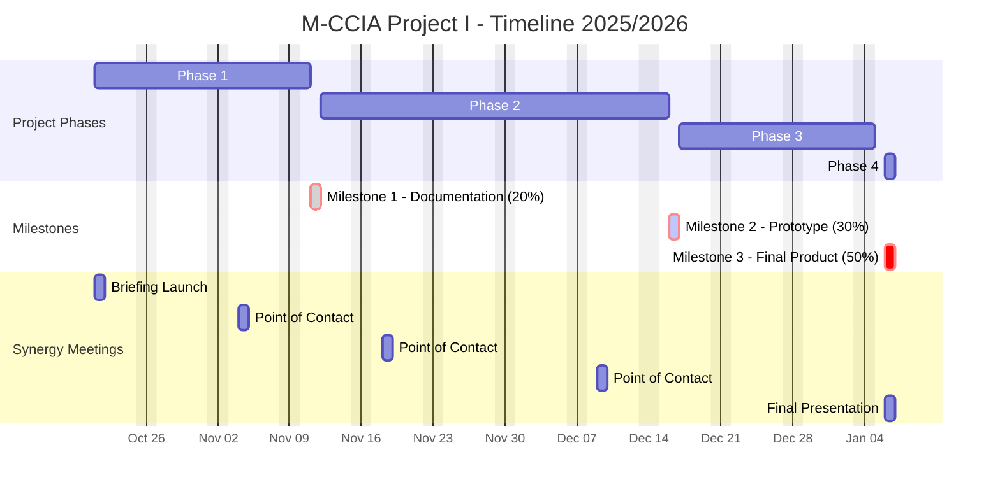

### Project Timeline – Gantt Chart

```mermaid
gantt
    title M-CCIA Project I - Timeline 2025/2026
    dateFormat  YYYY-MM-DD
    axisFormat  %b %d
    todayMarker on
    excludes weekends

    section Project Phases
    Phase 1: Research & Concept          :done, 2025-10-21, 2025-11-11
    Phase 2: Prototyping & Tech         :active, 2025-11-12, 2025-12-16
    Phase 3: Refinement & UX            : 2025-12-17, 2026-01-05
    Phase 4: Final Presentation          :milestone, 2026-01-06, 1d

    section Milestones
    Milestone 1 - Documentation (20%)    :crit, done, ms1, 2025-11-11, 1d
    Milestone 2 - Prototype (30%)      :crit, active, ms2, 2025-12-16, 1d
    Milestone 3 - Final Product (50%)    :crit, ms3, 2026-01-06, 1d

    section Synergy Meetings
    Briefing Launch                      :2025-10-21, 1d
    Point of Contact                    :2025-11-04, 1d
    Point of Contact                    :2025-11-18, 1d
    Point of Contact                    :2025-12-09, 1d
    Final Presentation                   :2026-01-06, 1d
```
